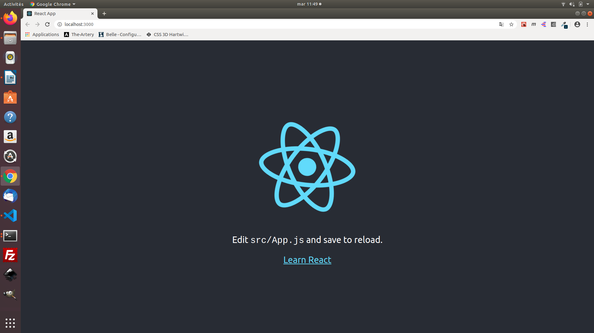
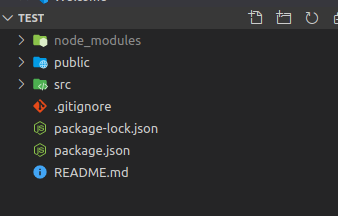
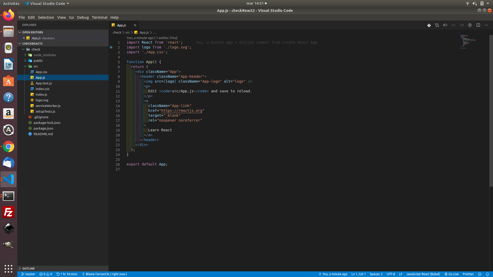
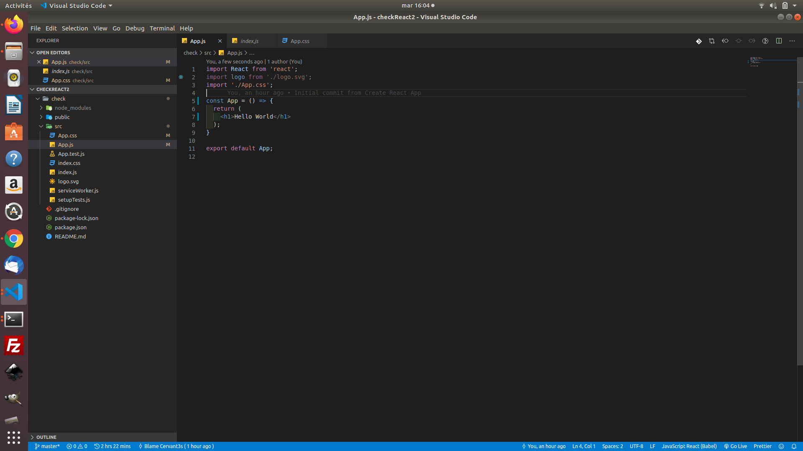
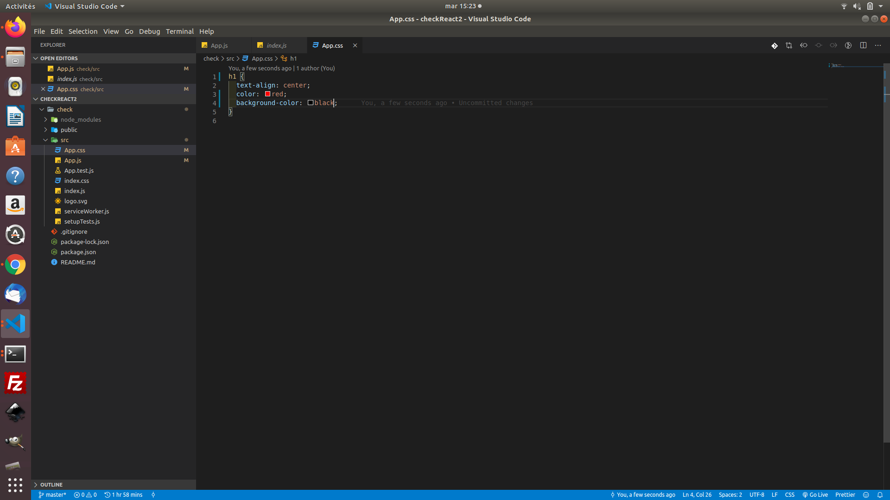
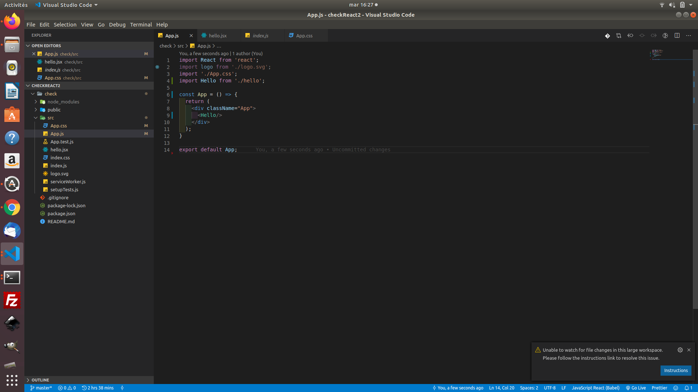
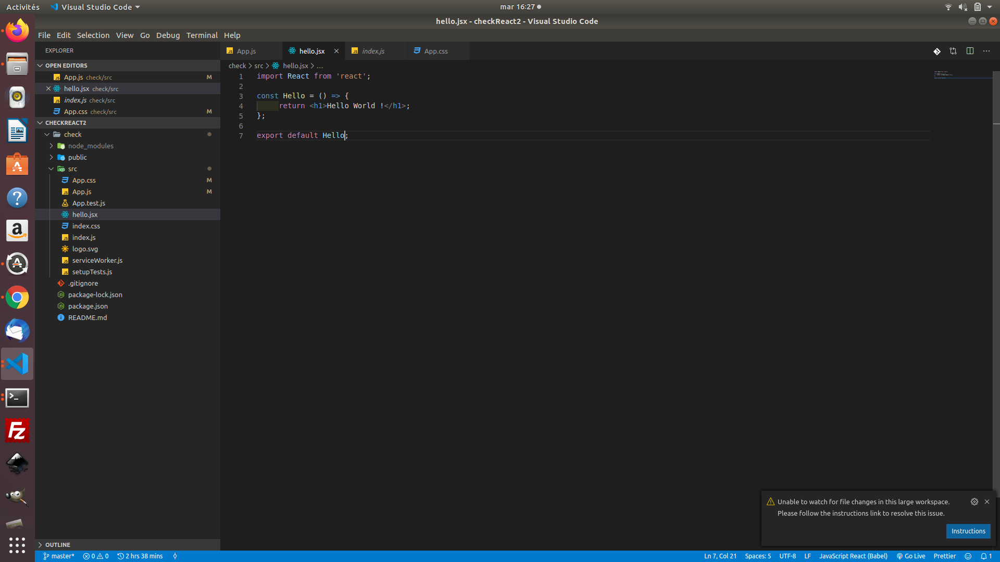

# Test


## React crash test

# How to do it !

Ok, I know the presentation was very long, but I had to mark out as much as possible the ground to destroy some often heard and meaningless legends.

## Well, now, how does it work ?

### CLI

To get started and to make configuration easier, we will use the CLI tool called create-react-app .

### Npx, npm, yarn...

For this tutorial, we will use npx and npm but you can find the corresponding methods quite easily.

```BASH
# init react app
npx create-react-app test

# go in
cd test

# start
npm start
```

#### Here's what you get

**http://localhost:3000/**



#### Structure



```BASH
my-app
├── public
│   ├── favicon.ico
│   ├── index.html
│   └── manifest.json
└── src
    ├── App.css
    ├── App.js
    ├── App.test.js
    ├── index.css
    ├── index.js
    ├── logo.svg
    └── serviceWorker.js
├── README.md
├── node_modules
├── package.json
├── .gitignore
```

#### App.js

- the main component is src/app.js, let's go, take the time to look at how the code works



- removes the content and test the famous "hello world", we'll update all this to ES6 directly.



- now take app.css file and replace the content with this one



**and that's all you are already able to work in a very simple way on your app.**

## Create your first "real" component

- now we are going to do things correctly, create a 'hello.jsx' file in order to call the component Hello, here is an update of both files

App.js


Hello.jsx


## JSX

- Jsx === XML JavaScript.

- JSX allows you to write HTML elements in JS and integrate them into DOMs without the need for methods like createElement() and / or appendChild()

- You can continue to use JS but it will be much simpler with JSX

A small example with "Hello World"

with **JS** in react

```JS
const App = () => {
  return React.createElement("h1", null, "Hello world!");
};

```

with **JSX**

```JSX
const App = () => {
    return <h1>Hello World</h1>
}
```

## Props and state

I will not really detail this passage, the first reason is that the doc is well written and there are many tutorials and resources, the second reason is that afterwards we will work with the hooks and the approach will be slightly different.

But if you want to dig deeper, ...
[React](https://reactjs.org)

### Props

Props === properties, it's a concept on react, it's an object that allows to store attributes and tags.

### State

Similar to props but the props we switch from one component to another will never change in the child component. They may change in the parent but not in the child. But, most of the time, we will have attributes that we want to change so we will store the attributes we want to change in the component in its state.

[Next](./hooks.md)


