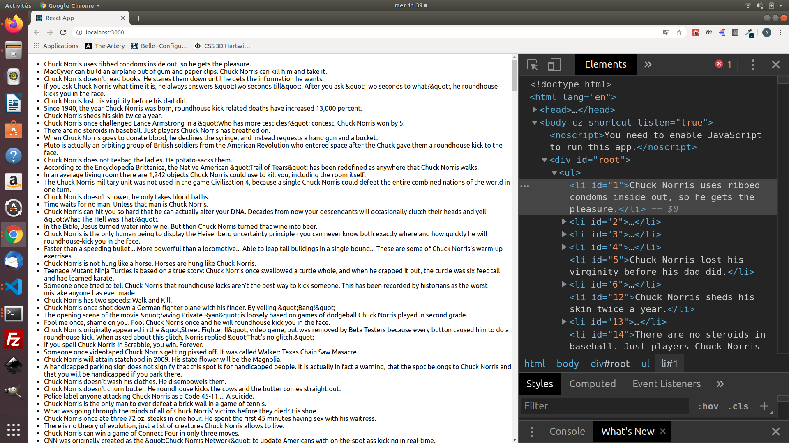

## Function vs class... no, the hooks !

- Before going further, it will first be necessary to understand some concepts of props, local state, context, refs and life cycle, you can continue to read but without a good understanding of these terms, it may be complicated, I invite you to visit the doc which is very well provided. [React](https://reactjs.org/)

- As you can see, the above example is very basic and if you want to do things in a clean way you will see that you will have to quickly switch to a more efficient structure.

- A year ago, we could have debated for a long time about the differences between functional react and classes but since the introduction of hooks, things have changed a lot, so we'll try to see it together.

- You'll find a lot of different resources on react, basic tutorials, tutorials with classes and many more, I'm going to devote myself here to the last integration of react, the hooks, because it's for me the most concrete way to get into react, the hooks make it much easier to use.

- Gradual upgrading : the classes still exist, don't worry and if you have already started react on this basis, it's a good thing, the following will just show you a "simpler" alternative to some concepts you already master and the hooks are fully compatible with the classes.
  **But warning, the hooks don't work inside a class**.

## Hooks ?

- According to react's website: "Hooks are functions that allow you to "plug in" to React's local status and lifecycle management from component functions".

- Wtf : In short, they are functions that allow you to use all the features of React classes in functional components.

- Why ? : **easier to understand**, **easier to handle**, **easier to maintain**, **easier to transpose**.

- To understand the hooks, we are going to take the official tuto react and detail it.

### useState()

- Here is the code of the Example class, a very basic counter

**App.js**

```JSX
import React from 'react';

class App extends React.Component {
  constructor(props) {
    super(props);
    this.state = {
      count: 0
    };
  }

  render() {
    return (
      <div>
        <p>You clicked {this.state.count} times</p>
        <button onClick={() => this.setState({ count: this.state.count + 1 })}>
          Click me
        </button>
      </div>
    );
  }
}

export default App;
```

- **Dissect** : we declare a counter, its state and init it to 0.

```JSX
constructor(props) {
    super(props);
    this.state = {
      count: 0
    };
  }
```

- When we want to display the current count in a class, we read this.state.count

```JSX
<p>You clicked {this.state.count} times</p>
```

- In the rendering, we call the this.setState at each click and increment on the state.count

```JSX
<button onClick={() => this.setState({ count: this.state.count + 1 })}>
```

**VS**

- Here's the equivalent with the hooks

**App.js**

```JSX
import React, {useState} from 'react';

function App() {
  const [count, setCount] = useState(0);

  return (
    <div>
      <p>You clicked {count} times</p>
      <button onClick={() => setCount(count + 1)}>
        Click me
      </button>
    </div>
  );
}

export default App;
```

- **Dissect** : declare a count and its state directly with useState
- If we declare a state variable with useState, we get a pair. The first element is the current value, and the second is a function that allows you to modify it. In this case, we define count, its future state and initialize it to 0

```JSX
const [count, setCount] = useState(0);
```

- After this, we can call count directly

```JSX
<p>You clicked {count} times</p>
```

- In the rendering, we just have to call up the status and we increment directly on the counter.

```JSX
<button onClick={() => setCount(count + 1)}>Cliquez ici</button>
```

- You can call multiple state variables

```JSX
const [count, setCount] = useState(0);
const [check, setCheck] = useState('give me five');
const [test, setTest] = useState(true);
const [form, setForm] = useState({username: '',password: ''});
...

```

### useEffect()

- For this example, we will use an api and to do this we will use axios, cut the project and in the terminal we have to install axios like this

```NPM
npm install axios --save
```

- and we're gonna use an api on the chuck norris fact, here's the link.

http://api.icndb.com/jokes/

- Easy, easy, easy...
  Okay, I'm breaking it down.

#### what is useEffect ?

**According to react:** The Effect Hook allows the execution of side effects in the component functions.
**Basically:** instead of saying side effect, we could say secondary effect, if it changes its state outside its local environment, so not just return a result, e.g. change the title, display an alert...

#### Axios

A simple npm package
Promise based HTTP client for the browser and node.js

#### All right, let's get back to it.

- Once that's done, we'll go back to our base component.

**App.js**

```JSX
import React, {useEffect, useState} from 'react';
import axios from 'axios';

const App = () => {
    const [jokes, setJokes] = useState([]);
    const [load, setLoad] = useState(false);
    const [error, setError] = useState('');

    useEffect(() => {
        axios.get('http://api.icndb.com/jokes/')
            .then(res => {
                setJokes(res.data);
                setLoad(true);
            })
            .catch(err => {
                setError(err.message);
                setLoad(true)
            })
    }, []);

    if (load) {
        return (
            <ul>{error ? <li>{error.message}</li> : jokes.value.map((fact) => <li class="joke" id={fact.id}>{fact.joke}</li>)}</ul>
        );
    }
    else {
        return (
              <div>Loading...</div>
        );
    }
};
export default App;
```

- **Dissect** : we import the usestate + useEffect and we import axios.

```JSX
import React, {useEffect, useState} from 'react';
import axios from 'axios';
```

- we initialize the useStates

```JSX
const [jokes, setJokes] = useState([]);
const [load, setLoad] = useState(false);
const [error, setError] = useState('');
```

- We retrieve the api data in the useEffect, we assign the setJokes which will be the answer, we set the setLoad to true and we assign the setError in case of request failure

```JSX
useEffect(() => {
        axios.get('http://api.icndb.com/jokes/')
            .then(res => {
                setJokes(res.data);
                setLoad(true);
            })
            .catch(err => {
                setError(err.message);
                setLoad(true)
            })
    }, []);
```

- We set up our condition, with the load, we retrieve the data, we process the structure and display the result in a small list

```JSX
    if (load) {
        return (
            <ul>{error ? <li>{error.message}</li> : jokes.value.map((fact) => <li class="joke" id={fact.id}>{fact.joke}</li>)}</ul>
        );
    }
    else {
        return (
            <div>Loading...</div>
        );
    }
```

- Here's what you should get



- To go further in the useEffect, there are those who need cleaning, I invite you to explore the documentation in detail to fully understand

### useContext()

- Context ? : Context in react is used when data must be accessible by many components at different nesting levels.

- We have a React app with a global component that contains many
  child components inside and you want to transmit data from the highest to the last child component.

- With React, there is a very simple hierarchy, data is transmitted from top to bottom from one component to another through props.

- You need to pass this data through each component, through their props, until you reach the last child component.

- It's very confusing and not very convenient and it brings a risk of error.

- The useContext() allows you to easily access data at different levels of the component tree, without having to pass data through props.

-[useContext()](https://reactjs.org/docs/hooks-reference.html#usecontext)

### Rules

- Hooks have some very strict [rules](https://reactjs.org/docs/hooks-rules.html), in order to do things correctly, react provides an eslint plugin in order to respect them.

```NPM
npm install eslint-plugin-react-hooks --save-dev
```

```esLint
// Your ESLint configuration
{
  "plugins": [
    // ...
    "react-hooks"
  ],
  "rules": {
    // ...
    "react-hooks/rules-of-hooks": "error", // Checks rules of Hooks
    "react-hooks/exhaustive-deps": "warn" // Checks effect dependencies
  }
}
```

### More ?

- Yes, the hooks api is a collection of other hooks, such as, useReducer, useCallback, useMemo, useRef, useImperativeHandle, useLayoutEffect, useDebugValue, you can find the reference here [refHooks](https://reactjs.org/docs/hooks-reference.html)

- Of course, once all this is well understood, you may need to set up a specific treatment and you can set up your own hooks.
